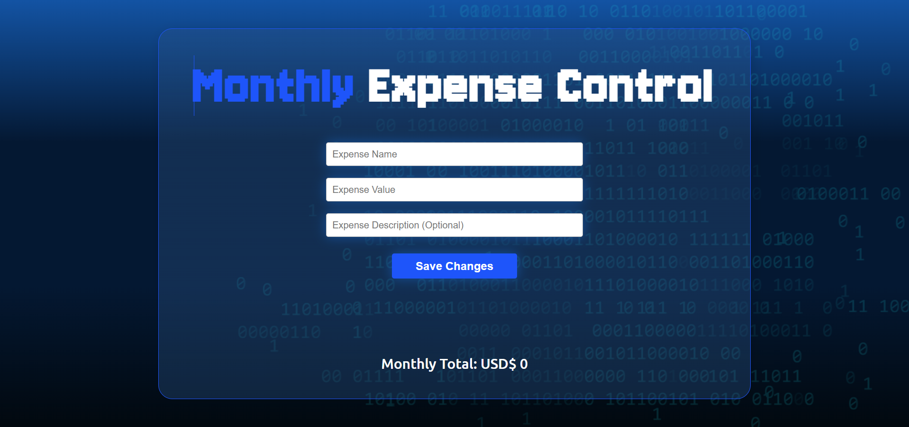
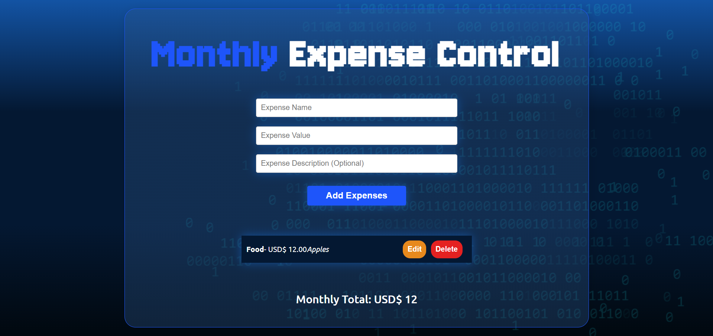

# Monthly Expense Control 💵

This is a monthly expense manager with input validation, alerts and the functions of a CRUD (Create, Read, Update, Delete)

## Demo 🚀

- **[Deploy in Vercel](https://monthly-expense-control-alura.vercel.app/)**

### Screenshots 📷

  
  

## Requirements ✅

- **[Node.js](https://nodejs.org/) (v14 or higher recommended)**
- **[npm](https://www.npmjs.com/) (Node.js package manager)**

## Installation 👨‍💻

1. Clone this repository or download the files.

  ```bash
    git clone https://github.com/Dacardonac/monthly-expense-control-alura.git
  ```

2. Navega a la carpeta del proyecto en tu terminal.

  ```bash
    cd monthly-expense-control-alura
  ```

3. Install the necessary dependencies.
  ```bash
    npm install
  ```

4. Execute the Project.

  Once the dependencies are installed, you can start the local development server with the following command:

  ```bash
    npm run dev
  ```
  This will open the project in your browser. Typically it runs at `http://localhost:3000`.

## Features 📄

- create, read, update, delete (CRUD) functions

- Total sum of expenses entered

- Using SweetAlert2 to display alerts.

## Contributions 👥

**If you would like to contribute to this project, please open a pull request or issue.**

## License 🌐

This project is licensed under the MIT License. See the [LICENSE](./LICENSE) file for details.
